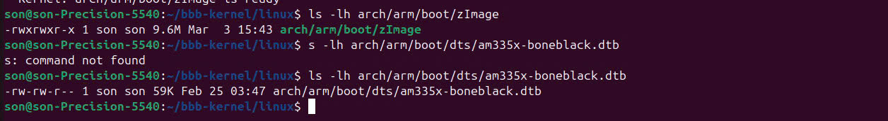
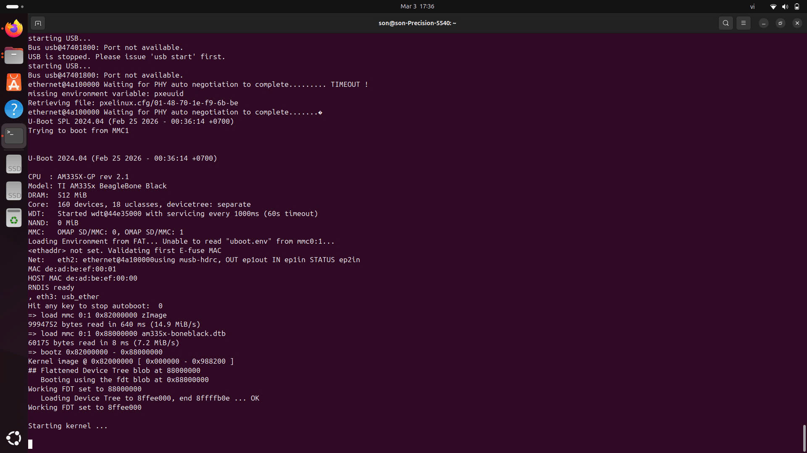

test

## Hình ảnh 2.1

**Giải thích:** Hình ảnh hiển thị quá trình boot thành công vào hệ điều hành Linux (được build bằng Buildroot) dưới quyền root. Người dùng đang chạy thử một file thực thi `hello` và file này in ra kết quả "Hello from BBB!".

## Hình ảnh 2.2

**Giải thích:** Hình ảnh cho thấy việc kiểm tra kích thước các file đã biên dịch. Người dùng dùng lệnh `ls -lh` để xem dung lượng của file kernel image `zImage` (~9.6M) và file Device Tree Blob `am335x-boneblack.dtb` (59K).

## Hình ảnh 2.3

**Giải thích:** Hình ảnh ghi lại quá trình U-Boot đang thực thi trên mạch. Cụ thể là các lệnh tải (load) kernel image (`zImage`) và Device Tree (`am335x-boneblack.dtb`) từ thẻ nhớ (mmc) vào bộ nhớ RAM, sau đó sử dụng lệnh `bootz` để khởi động Linux kernel.

## Hình ảnh 4.1
